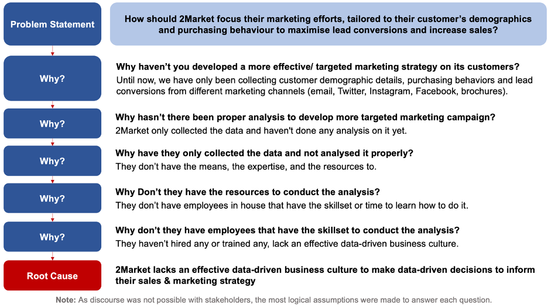
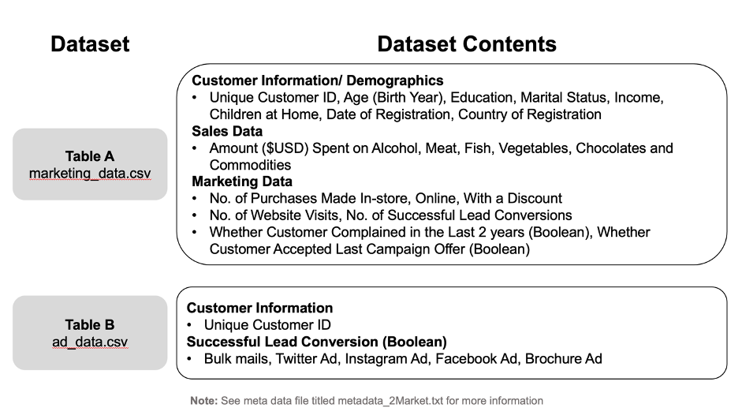
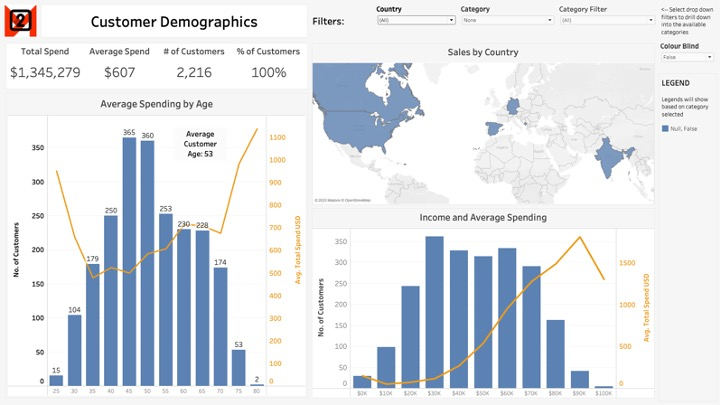

<h1>2Market: Understanding your Customers</h1>
  <h3> Topics Covered</h3>
  
  * The Data Analytics Process
  * Excel for Data Analysis (transforming data, pivot tables, filtering, data visualisation)
  * Tableau (data manipulation, interactive visualisations, designing dashboards)
  * Relational Database Management (database design and entity-relationship diagrams)
  * SQL and Analysing Data with SQL
  * Data Ethics

Grade: __93% (Distinction)__

<h2>Assignment Overview</h2> 
  

  This project required working as a data analyst with 2Market, a global supermarket which sells products online and in-store. The aim is to help them better understand their customers purchasing behaviour by analysing their sales, marketing and advertising data. In particular, 2Market want to understand:
    
1. The demographics of their customers
2. Which advertising channels seem to be the most effective
3. Which products seem to sell the best and if that varies based on demographic

Utilising the Five Why’s structured thinking framework, the business problem and example root cause are outlined for this project below. 

<h2>Data Utilised</h2>

The analysis is based on two primary datasets from 2Market:

These datasets were subjected to rigorous cleaning and transformation to ensure data quality and usability.

## Analytical Approach
- **Data Cleaning and Transformation:** The data underwent extensive preprocessing, including adding new columns for analysis, modifying column headings, and correcting data types and formats.
- **Pivot Tables and SQL Queries:** Initial insights were derived using pivot tables in Excel, followed by more advanced analysis through SQL queries.
- **Tableau for Visualisation:** Key findings were visualized using Tableau, focusing on relevant insights like customer demographics correlation with spending.

## Key Findings
- **Customer Demographics:** The average customer age is 53, with the 40-50 age bracket representing a significant portion of the customer base. No substantial relationship was found between age and income.
- **Product Popularity:** Alcohol, meat, and fish emerged as the most popular product categories across various demographics and countries.
- **Advertising Effectiveness:** Analysis of advertising channels revealed Twitter as having the highest average conversion rate, followed by bulk mail, Instagram, and Facebook.

## Tableau Dashboard

## Recommendations
Based on the analysis:
- **Data Optimisation for Tableau:** It is suggested that 2Market optimise its data structure for better compatibility with Tableau.
- **Advertising Strategy:** Allocation of marketing budgets should be proportionate to the performance of advertising channels in each country.

## Future Scope
Further analysis can explore the impact of demographic variables on customer spending patterns and refine the advertising strategy based on more granular data.

<h2>Findings and Recommendations - Final Stakeholder Presentation</h2> 

